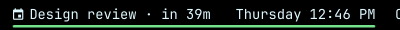
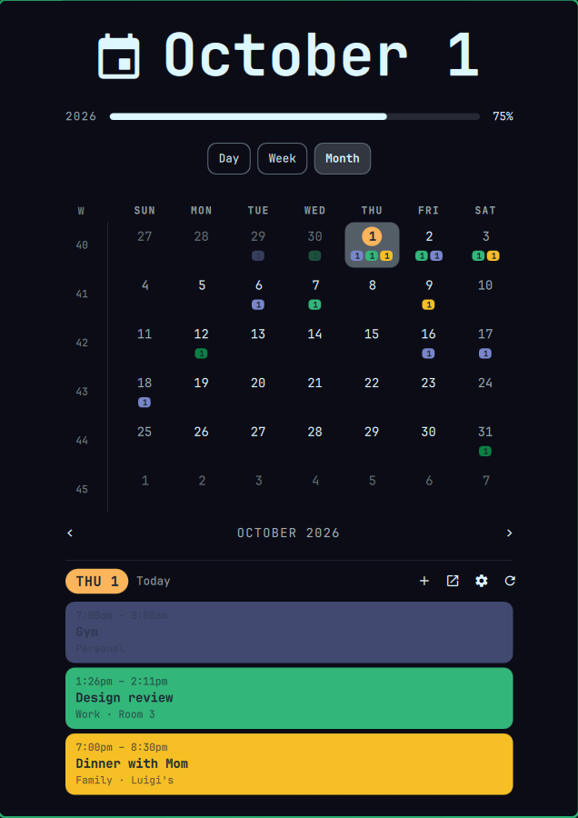
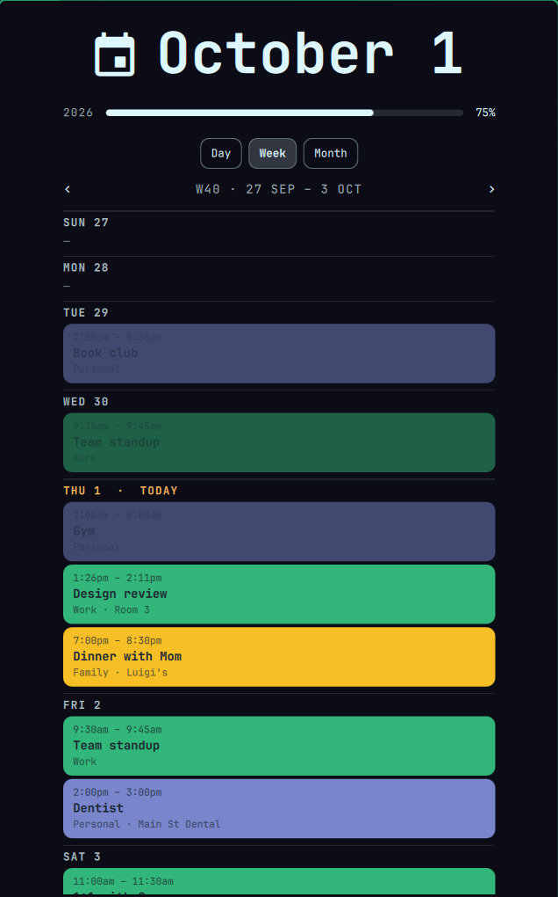
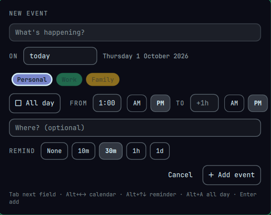

# Google Calendar for Omarchy

Your Google Calendar in the [Omarchy](https://omarchy.org) bar. Omarchy's
clock stays where it was, with your next event in front of it. Click it for
your calendar.



<p>
  
  
</p>

- **In the bar:** your next event and when it is (`Design review · in 39m`,
  `Dentist · tue 2:00 PM`), then `until 2:11pm` while it runs. Hover for
  details.
- **Day, week and month views** in the popup (`D` / `W` / `M`). The month grid
  shows a colored chip per calendar with that day's count.
- **Quick add from anywhere:** press **Alt+Shift+Space**, or `N` in the popup.
  Days can be typed loosely (`fri`, `tomorrow`, `3 oct`), times are picked with
  AM/PM, and the event goes straight to Google, so it shows up on your phone.
- **Reminders** arrive as desktop notifications at each event's own Google
  reminder time.
- **Links open as an Omarchy web app**, not a browser tab.
- **Nothing runs in the background.** A short sync runs once a day, at login,
  and when you open the popup. With the optional hooks it also runs after wake
  and when you reconnect. Each sync exits as soon as it's done.
- **Looks after itself:**
  - a popup if a sync really fails (being offline doesn't count);
  - a ⚠ in the bar if the last good sync is over 36 hours old;
  - a check after every `omarchy update`;
  - `calsync-doctor` for a plain-English health report.

The screenshots use made-up events.



## Requirements

- Omarchy 4 (tested on 4.0.4)
- [gcalcli](https://github.com/insanum/gcalcli), from the AUR
- Your own Google Cloud OAuth client. This is free and takes about 20 minutes,
  once. Google requires it for any personal app that reads your calendar.

## Install

```bash
# 1. gcalcli
omarchy pkg aur add gcalcli

# 2. Your Google OAuth client: follow GOOGLE_SETUP.md, then sign in
gcalcli init

# 3. The plugin, then its setup (sync, timers, swapping out the stock clock)
omarchy plugin add https://github.com/dawestheperson/omarchy-google-calendar --yes
~/.config/omarchy/plugins/dawestheperson.gcal/install.sh
omarchy restart shell

# 4. Optional: also sync when you reconnect and when you wake from sleep
sudo ~/.config/omarchy/plugins/dawestheperson.gcal/root/install-root.sh
```

Step 3 swaps Omarchy's clock for this one in the same spot, and keeps your clock
format. The stock clock is only disabled, not removed.

Step 4 installs two small root-owned hooks. All they do is ask *your user's*
systemd to start the sync; nothing extra runs as root. Read
`root/install-root.sh` first if you like; it's short.

Check that everything is healthy:

```bash
calsync-doctor
```

## Update

```bash
omarchy plugin update dawestheperson.gcal
~/.config/omarchy/plugins/dawestheperson.gcal/install.sh
omarchy restart shell
```

## Uninstall

```bash
sudo ~/.config/omarchy/plugins/dawestheperson.gcal/root/install-root.sh --remove   # first, if you ran step 4
~/.config/omarchy/plugins/dawestheperson.gcal/install.sh --uninstall
```

This puts the stock clock back. Your Google calendar isn't touched.

## Using it

| Where | Key | Does |
|---|---|---|
| Anywhere | Alt+Shift+Space | Quick add |
| Popup | `D` `W` `M` | Day, week, month view |
| Popup | ← → | Previous / next month, week or day |
| Popup | `T` | Today |
| Popup | `N` | New event |
| Popup | `O` | Open the day in Google Calendar |
| Popup | `R` | Re-read the calendar |
| Popup | `Shift+W` | Start weeks on Sunday or Monday |
| Popup | `S` | Settings |
| Clock | right-click | Cycle the clock format |

Settings (`S` in the popup) cover what the bar shows, 12- or 24-hour time,
and calendars to hide. Calendars you untick in Google Calendar are left out
already.

## How it works

`calsync`, a systemd oneshot, reads about 7 days back and 45 ahead from
Google, using gcalcli's login. It writes that to a small JSON cache in
`~/.local/state/calsync/`, sets one-shot reminder timers for the next 48
hours, and exits. The bar only ever reads the cache. Events you add go to
Google through `gcalcli add`, and a sync follows immediately.

[NOTES.md](NOTES.md) has the full architecture, every file location, and a
table of common problems with their fixes.

## Credits and license

MIT; see [LICENSE](LICENSE). The calendar UI started from
[OmaCal](https://github.com/crmne/omacal) by Carmine Paolino, and the clock is
Omarchy's own. Details are in [THIRD_PARTY_NOTICES.md](THIRD_PARTY_NOTICES.md).

This is a personal project, provided as-is. It is not affiliated with,
endorsed by or supported by Google or Omarchy. Google Calendar is a trademark
of Google LLC.
